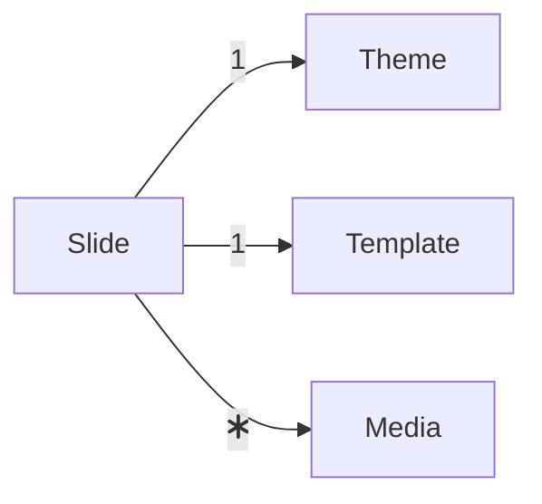
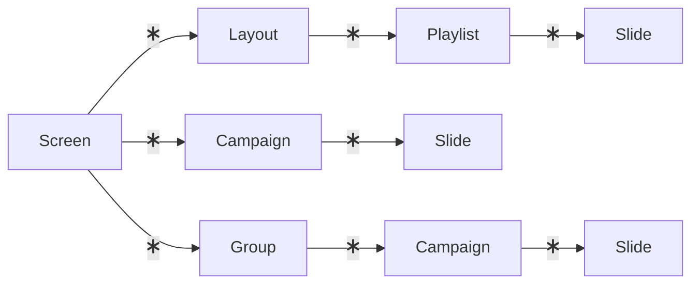

# Display admin

The admin for OS2Display ver. 2.

This is based on create-react-app.

## Docker development setup

### Create public/config file

By default the api that is requested is located at `/api/`.
This can be configured by:

```bash
cp public/example_config.json public/config.json
```

And modify the entries to suit your setup.

```json
{
  "api": "[WHERE TO FIND THE API]"
}
```

### Create public/access-config file

This file contains the access config.

```bash
cp public/example-access-config.json public/access-config.json
```

### Up the containers

```bash
docker-compose up -d
```

### Install npm packages

```bash
docker-compose run node yarn
```

## Testing with cypress

We use [cypress](https://www.cypress.io/) for testing.

To run cypress tests in the cypress container:

```bash
docker-compose run cypress run
```

### Linting

```bash
docker-compose run node yarn check-coding-standards
```

```bash
docker-compose run node yarn apply-coding-standards
```

### Redux Toolkit

The communication with the API is generated from an OpenAPI
specification with Redux Toolkit.

To regenerate (when the API specification has changed):

```bash
docker-compose exec node bash
cd src/redux/api

# Action: Replace api.json with the new api.json OpenAPI specification

# Install and run scripts to generate ned Redux Api slices.
npm install
npm start
```

## System description

| Component   | Description  | Accessible by |
| ----------- | :----------- | :-----------  |
| Slide | A slide is the visible content on a screen. | Admin |
| Media | Media is either images or videos used as content for slides. | Admin, editor |
| Theme | A theme has css, that can override the slide css. | Admin |
| Template | The template is how the slide looks, and which content is on the slide | ? |
| Playlist | A playlist arranges the order of the slides, and the playlist is scheduled. | Admin, editor |
| Campaign | A campaign is a playlist, that takes precedence over all other playlists on the screen. If there a multiple campaigns, they are queued. A campaign is either directly attached to a screen, or attached to a group affecting the screens that are members of that group. | Admin |
| Group | A group is a collection of screens. | Admin |
| Layout | A layout consists of different regions, and each region can have a number of playlists connected. A layout is connected to a screen. | ? |
| Screen | A screen is connected to an actual screen, and has a layout with different playlists in. | Admin |




